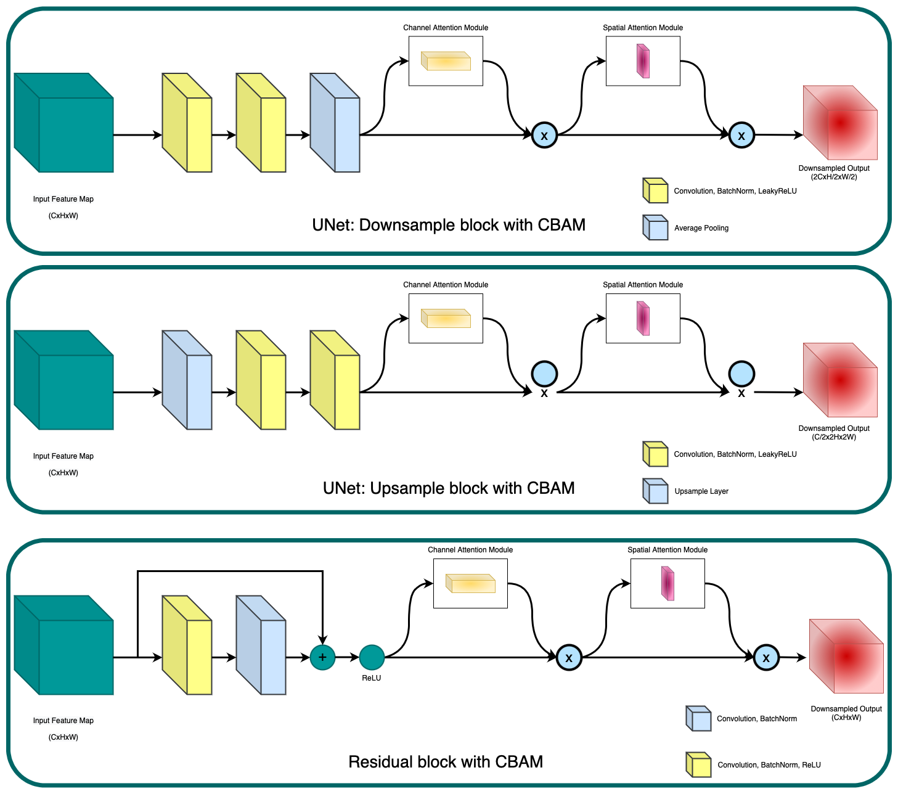
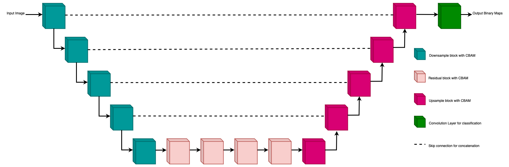
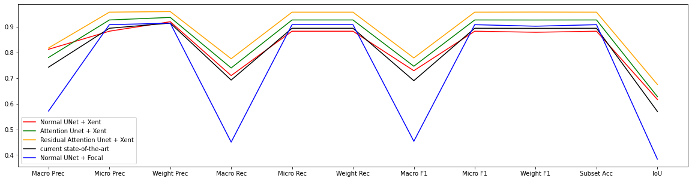

<center>

## SADMA: SAtellite baseD MArine debris detection

[](https://paperswithcode.com/sota/image-segmentation-on-marida?p=resattunet-detecting-marine-debris-using-an)
<a href="#"></a>
<a href="https://pytorch.org/"></a>
<a href="#"></a>

</center>

Implementation of the Residual Attention UNet in PyTorch on [MARIDA](https://github.com/marine-debris/marine-debris.github.io). Marine Debris Archive (MARIDA) is a marine debris-oriented dataset on Sentinel-2 satellite images. It also includes various sea features that co-exist. MARIDA is primarily focused on the weakly supervised pixel-level semantic segmentation task.  This repository hosts the basic tools for the extraction of spectral signatures as well as the code for the reproduction of the Residual Attention UNet model.

MARIDA can be easily downloaded from [here](https://doi.org/10.5281/zenodo.5151941). Alternatively, MARIDA can be downloaded from the Radiant MLHub.

<h2> Contents </h2>

- [SADMA: SAtellite baseD MArine debris detection](#sadma-satellite-based-marine-debris-detection)
- [Pre-print Paper](#pre-print-paper)
- [Installing requirements](#installing-requirements)
- [Model details](#model-details)
  - [Figure 1: Building blocks of ResAttUNet](#figure-1-building-blocks-of-resattunet)
  - [Figure 2: ResAttUNet Architecture](#figure-2-resattunet-architecture)
- [Results](#results)
  - [Figure 3: Results on test dataset](#figure-3-results-on-test-dataset)
- [Pre-trained Weights](#pre-trained-weights)
- [Author Details](#author-details)
  
## Pre-print Paper
The link to the pre-print paper shall be added soon.
## Installing requirements
The requirements for running the code can be easily installed using the ```requirements.txt``` file. To install the requirements just use:
```bash
pip install -r requirements.txt
```
Once the requirements are installed, you can use the training and evaluation code easily.

## Model details
The introduced model is a mixture of existing Residual blocks and Convolutional Block Attention Module with a simple UNet model. The residual blocks are used after the downsampling layers to extract deeper features, and channel and spatial attention is used to apply extra attention to the sparse nature of the debris.
The blocks used in the network are shown in [Figure 1](#building-blocks-of-resattunet)
<div>
<center>

### Figure 1: Building blocks of ResAttUNet 



</center>
</div>

The complete network architecture is shown in [Figure 2](#figure-2-resattunet-architecture)
<div>
<center>

### Figure 2: ResAttUNet Architecture



</center>
</div>

## Results
The introduced model achieves state-of-the-art results across all metrics on the test set of MARIDA.
[Figure 3](#figure-3-results-on-test-dataset) shows the performance of various models discussed, along with existing state-of-the-art results on the dataset.
<div>
<center>

### Figure 3: Results on test dataset



</center>
</div>

## Pre-trained Weights

The pre-trained weights for the model can be downloaded from [Google drive](https://drive.google.com/drive/folders/13WIrYVOIK1WZ1kFlZoOfXpjwyhAedXLF?usp=sharing)

## Author Details

- Name: Azhan Mohammed 
- LinkedIn: https://www.linkedin.com/in/azhanmohammed/
- Personal Website: https://www.azhanmohammed.xyz

